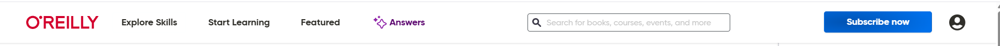
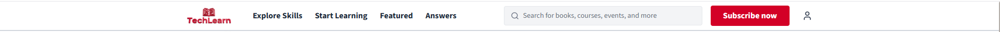

Precisa arrumar ainda:

- ADICIONAR MAIS ESPAÇO ENTRE AS ABAS DA NAVBAR
 vs 

book-header.tsx (ONDE PODE MUDAR O TAMANHO DA MOLDURA DOS LIVROS

metadata-list.tsx (ONDE LISTA TODOS OS ANOS, ANO ATUAL, AQUELAS PARADAS DE "TIME TO COMPLETE")

global-nav-bar.tsx (ONDE PODE MUDAR TODA A NAVBAR "EXPLORE SKILLS..")

Arrumar o text-gray-600 pra 100 no avatar-profile [00h13am]
Adicionar schedule learning modal [1h29]
Adicionar sistema de Add to playlist [1h29]
Adicionar GLM 4.7 como AI assistant [1h29]